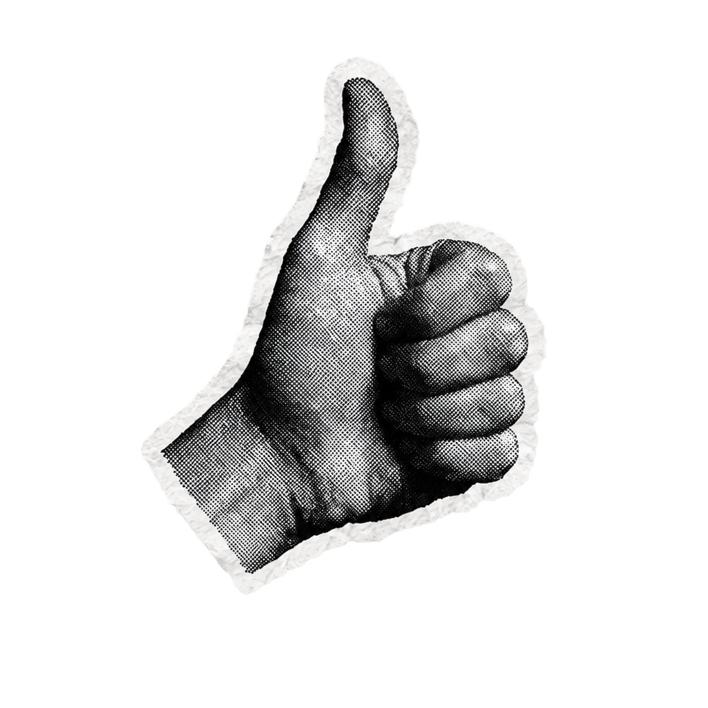
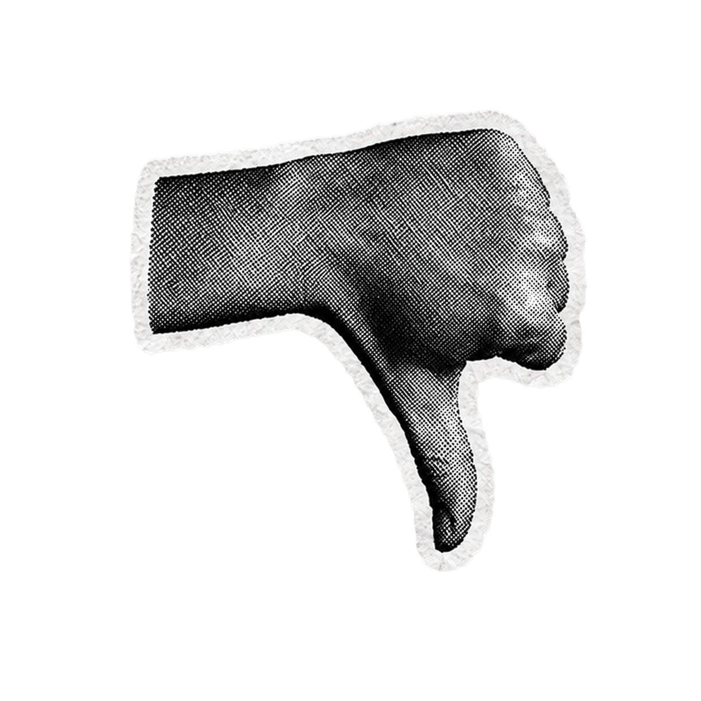
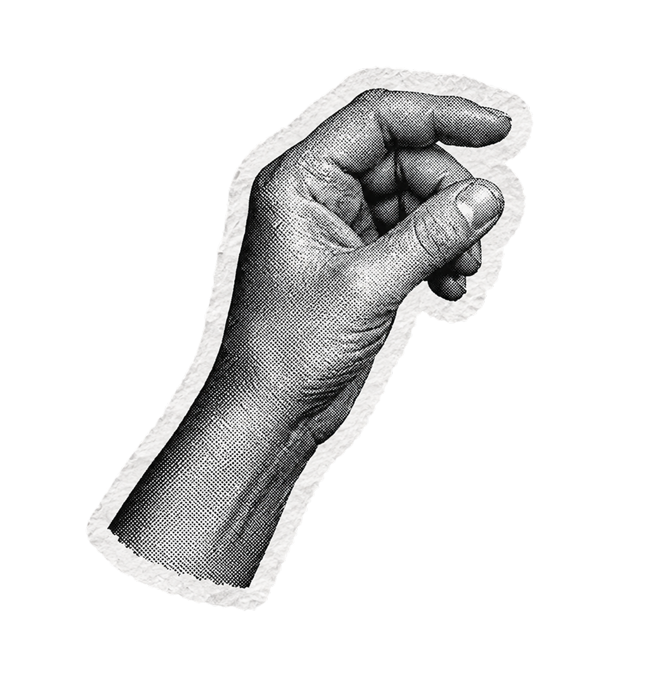
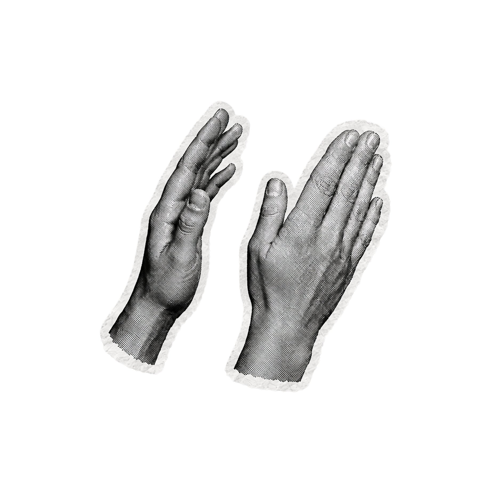
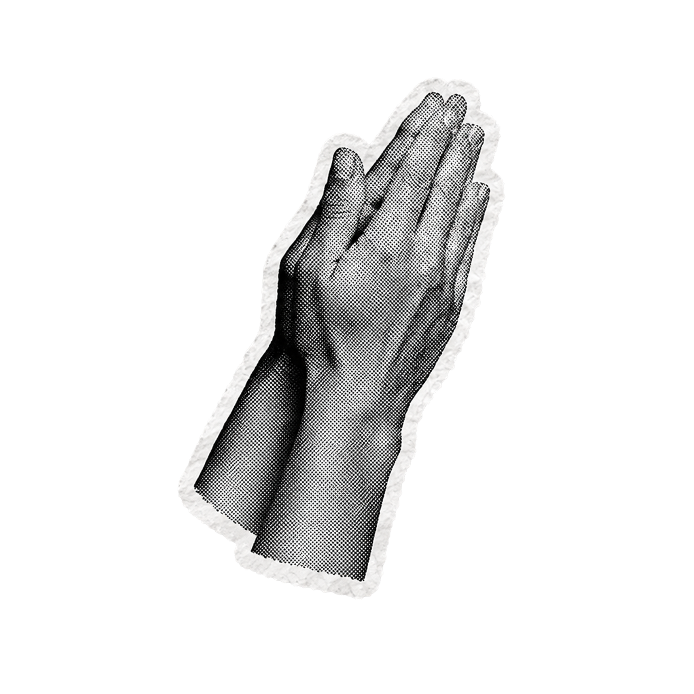
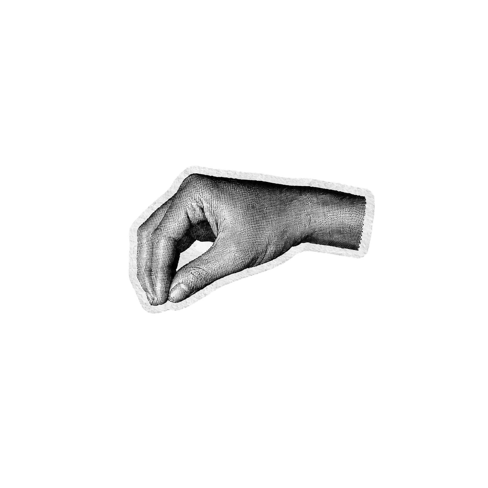
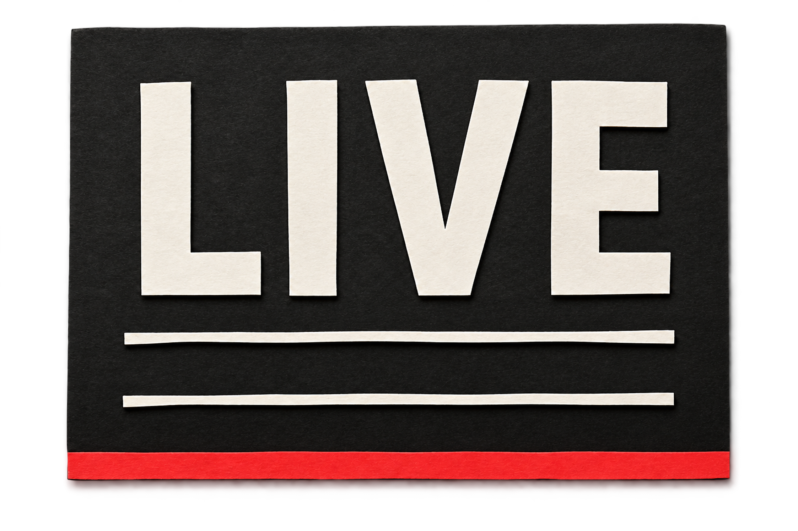
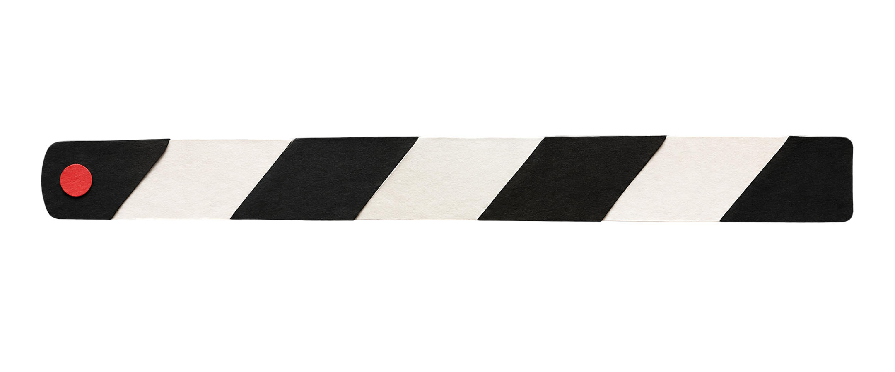

# How we made the assets for LIVE

LIVE needed 37 pictures. Nine of them were frames exported from the film itself, so 28 had to be
generated.

This page shows why the assistant wrote the prompts rather than us, and two of the real ones.

## Why we didn't write the prompts ourselves

The order of work was:

1. **The style rules were written down first.** See
   [choosing a visual style](../../choosing-a-visual-style/reference/worked-examples.md).
2. **The assistant listed every picture the film needed and wrote the prompt for each one** — 12 to
   generate on their own, 16 to generate once and then recolour and reuse in code, and 9 to export
   from the film later rather than generate at all.
3. **We pasted those prompts into ChatGPT** and generated the images.
4. **The images went back into the project** under `public/assets/live-showcase/`, and the assistant
   built the scenes with them.

Two reasons to work this way, and the first is the one people don't expect.

**It writes a far more detailed prompt than you would.** Give it the style rules and a screenshot of
something you like, and it turns that picture into precise words — the material, the colour, the
angle, how the edges end. It also spends as much of the prompt saying **what not to do** as saying
what to make: no gradients, no gloss, no shadow, no 3D, no background. Those are the things image
generators add on their own unless you stop them, and a person writing the prompt by hand asks for
the thing and forgets the nos.

**It knows what the code will need from the picture**, which you cannot see when you are just asking for a nice image — that a part which has to move needs to arrive as its own file, that two pictures which must match have to be made in one go, that something can be recoloured in code instead of generated twice.

You generate. It specifies. It builds.

## The paragraph we pasted above every prompt

This went above **every single one** of the 28 prompts, word for word, never paraphrased:

> Paper cut-out collage element for a motion graphics film. Physical cut paper aesthetic — visible
> paper fiber texture, slight surface grain, matte and unglossy, as though scissored or torn from a
> real sheet and scanned flat. Riso-print / screenprint feel. No gradients, no gloss, no drop shadow,
> no bevel, no 3D rendering, no perspective. Photographed perfectly flat, straight on, evenly lit with
> no directional light. Isolated on a fully transparent background. No background elements, no scene,
> no surface beneath it.

Look at how much of it is a list of things not to do. It sets the material, blocks what generators
add by default, and it is what makes 28 separately-generated files look like one film.

## Prompt 1 — the six hands, as one picture

The film needed one hand in six positions, and the instruction in our notes was emphatic: **do not
generate these as six separate images.** Six separate generations produce six different hands —
different skin, different shirt cuff, different wrist angle, different lighting.

One moment in the film rotates a thumbs-down slowly into a thumbs-up, which only works if it is
visibly the same hand. So all six were generated as one sheet, then cut apart afterwards.

> [the style paragraph above]
>
> A reference sheet of ONE person's right hand in six gestures, arranged in a 3×2 grid on a plain
> white background, each pose clearly separated with generous space around it. High-contrast black and
> white photography — real photographic hand, not illustrated, not vector, deep blacks and clean
> whites with visible skin texture, printed halftone grain. Every pose is the identical hand with the
> identical shirt cuff, identical lighting, and the wrist entering from the same angle in every panel.
>
> The six gestures: (1) thumbs up, (2) thumbs down, (3) open hand gripping the edge of a sheet of
> paper as if holding it up, (4) two hands together mid-clap, palms apart, (5) the same two hands with
> palms touching, (6) an "OK" / chef's-kiss gesture, fingertips pinched.
>
> Each hand is torn out of paper — a rough, fibrous torn paper edge runs around the outside of each
> cutout, with a pale feathered fringe where the paper fibers separate.

Notice how much of that is spent insisting on sameness — "ONE person's", "the identical hand",
"identical shirt cuff", "identical lighting", "the same angle in every panel". The repetition is
deliberate.

The six results, cut out of the one sheet:

| | | |
| --- | --- | --- |
|  |  |  |
|  |  |  |

*Look at the cuff and the wrist angle across all six. That consistency is what the prompt bought.*

**The lesson: generate together the things that have to match.**

## Prompt 2 — the clapboard, in two pieces

The film's clapboard has to snap shut. That means the striped arm has to swing, and a single picture
of a whole clapboard cannot swing.

So it was specified as two files from the start, with the body described the same way in both prompts
so the pieces would fit together.

**`props/clapboard-body.png`**

> [the style paragraph above]
>
> The lower body of a film clapperboard, cut from paper — WITHOUT the hinged clapper stick on top. A
> rectangular slate in deep near-black `#14120F` paper, with the word "LIVE" across it in large bold
> condensed sans-serif letters cut from off-white `#F4F1EA` paper. Below the word, two thin horizontal
> ruled lines suggesting blank information rows. A narrow `#FF4438` red paper strip along the bottom
> edge. Clean cut edges with a very slightly hand-wobbled, imperfect line. Straight-on flat view.

**`props/clapboard-arm.png`**

> [the style paragraph above]
>
> ONLY the hinged clapper stick from the top of a film clapperboard, alone, horizontal, nothing else
> in the image. A long narrow paper bar with alternating diagonal stripes of deep near-black `#14120F`
> and off-white `#F4F1EA`, each stripe hand-cut so the diagonals are slightly irregular and not
> perfectly parallel. A small `#FF4438` red paper circle at the far LEFT end marking the hinge pivot.
> Clean cut edges with a slightly hand-wobbled line. Straight-on flat view.

What came back:

| The body | The arm |
| --- | --- |
|  |  |

*The small red dot at the left end of the arm is not decoration.*

It marks the exact point the arm swings around, so the code has something to measure from. It sits
hidden behind the body in the finished film and nobody watching ever sees it — and asking for a mark
you will never show is exactly the kind of thing you would not think to put in a prompt yourself.

**The lesson: split apart the things that have to move separately.**

## Where the files went

```
public/assets/live-showcase/
├── agents/     the AI logos, and one generic mark
├── hands/      the six cut-out hands
├── props/      the clapboard, the storyboard sheet, the wordmark
└── texture/    paper ground, scraps, cut squares, scribbles
```

The `texture/` folder is the reusable group from the main guide. Those few files are recoloured and
resized in code and reappear throughout the whole film.

## All of the prompts

Every one of the 28, with the reasoning for each, plus the nine frames exported from the film itself.

Full detail: `../content/live-showcase/docs/assets.md`
